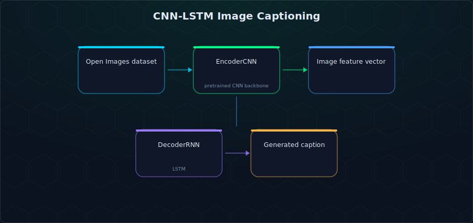

# CNN-LSTM Image Captioning

An encoder-decoder image captioning model: a CNN reads the image into a feature vector, an LSTM reads that vector into a natural-language caption.

## What it does

This is the classic neural image captioning architecture (Vinyals et al.-style "Show and Tell") trained on the **Open Images** caption dataset. A pretrained CNN backbone (`EncoderCNN`) compresses each image into a fixed-size embedding; an LSTM-based `DecoderRNN` then generates the caption one word at a time, conditioned on that embedding and a learned vocabulary built from the training captions.



## Key features

- **Custom vocabulary builder** mapping every unique caption word to an integer token (and back)
- **`EncoderCNN`** — pretrained CNN backbone (via `torchvision.models`) fine-tuned to produce fixed-length image embeddings
- **`DecoderRNN`** — LSTM decoder generating captions word-by-word from the image embedding, trained with padded/packed sequences for variable-length captions
- **Train/validate loop** with per-batch loss tracking on the Open Images training and validation splits
- **Inference utility** to load an arbitrary image and generate a caption from the trained model

## Tech stack

`Python` · `PyTorch` · `torchvision` · `torch_snippets` · Google Colab / `openimages` downloader

## Repository structure

```
ImageCaptioning/
├── Programming_Assignment_05_INFO5505_Krishna_Chilappagari.ipynb   # Full pipeline: data, model, training, inference
└── data.csv
```

## Setup

This notebook was built for Google Colab (image downloads use Drive mounting + the `openimages` package). To run it:

```bash
git clone https://github.com/ananthakrishna4747/ImageCaptioning.git
cd ImageCaptioning
pip install torch torchvision torch_snippets openimages pandas tqdm
```

Open `Programming_Assignment_05_INFO5505_Krishna_Chilappagari.ipynb` and run top to bottom. The notebook will:
1. Download a subset of Open Images train/val images + their captions
2. Build the caption vocabulary
3. Train the encoder/decoder for a configurable number of epochs
4. Generate a caption for a sample image at the end

## License

No license file is currently included in this repository — treat as coursework/educational project code.
